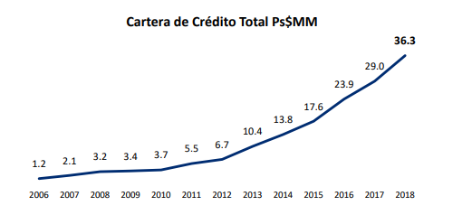

# **Integrantes**
## **Aniel Esthefania Villanueva Mendoza**
## **Jesús Iván Lafarga Lizárraga**
## **José Pablo Vázquez Tello**


# **Parte 1: Descripción del activo CREAL.MX**

En este sección cubriremos toda la descripción del giro de la empresa Crédito Real, algunas recomendaciones de por que comprar su acción y cuales son los principales riesgos a los que se enfrenta esta empresa, según la actividad a la que se dedica esta gran compañía financiera.


Crédito Real inicia actividades en el año de 1993 con crédito al consumo otorgando créditos para la adquisición de bienes duraderos a través de su producto Crédito Tradicional. El año siguiente, en 1994 la empresa realizó su primera emisión de deuda en mercado local por 20 MDP. Hasta 2005 su negocio se centró en torno a los créditos para bienes duraderos para la compra de aparatos de línea blanco (estufas, lavadoras), otra actividad relevante es la compraventa de cuentas por cobrar.

Para el año de 2007, CREAL se fusionó con Crediplus, una empresa cuya actividad primaria era originar créditos personales, así CREAL inició su negocio de créditos grupales bajo la marca de "CrediEquipos". Para finales del mismo año, Crédito Real se asoció con Nexxus Capital (reconocido operador de fondos de inversión en capital privado) adquiriendo una participación accionaria del 22.5%.

En 2011 adquirió Grupo Kon tomando control del 49% de sus acciones. La adquisición se efectuó mediante la fusión de Crédito Real con Rasteroz, Futu-lem, de esta manera los miembros de las familias fundadores pasaron a ser accionistas directos de Crédito Real, quien a su vez adoptó la modalidad de Sociedad Anónima Promotora de Inversión. El 18 de Noviembre adquirió el 49% del capital social de Publiseg (uno de los principales distribuidores de créditos con pago vía nómina)

Actualmente su actividad económica gira en torno a la realización habitual y profesional de operaciones de crédito, arrendamiento financiero y factoraje financiero (funciona como un intermediario financiero no bancario). La compañía ofrece soluciones financieras para los segmentos bajo y medio de la población, históricamente poco atendidos por el sistema bancario, sus productos son:

*   créditos con pago vía nómina.
*   créditos de consumo.
*   créditos para autos usados.
*   créditos para pequeñas y medianas empresas.
*   créditos grupales.

Según datos del Instituto Nacional de Estadística y Geografía estos segmentos abarcan aproximadamente el 75.9% de la población nacional. El 31 de Diciembre de 2018, el monto principal de los créditos vigentes de la compañía era de $36,301.6 millones y contaba con 851,869 clientes.



Podemos observar como la cartera de créditos otorgados por la compañía tiene una tendencia creciente

Por su parte, no solo tiene presencia en México, además, desde 2015 otorga soluciones financieras en 27 estados de Estados Unidos, de la misma manera tiene presencia en Costa Rica, Panamá, Honduras y Nicaragua, otorgando crédito al consumo, mediante la realización de operaciones de crédito y factoraje financiero. Sus oficinas se encuentran en la Ciudad de México en la Avenida Insurgentes Sur y cuenta con poco mas de 1160 empleados.

Empresas con participación accionaria:
  
(@) Kondinero (99%)
(@) Crédito Maestro (49%)
(@) Credifiel (49%)
(@) CR Fact (51%)
(@) Instacredit (70%)
(@) Camino Financial (26.93%)
(@) Crédito Contigo (36.28%)
(@) Somos Uno (23%)
(@) Credilikeme (35.06%)


## **¿Por qué comprar acciones de CREAL.mx?**

* Cotiza desde el 9 de agosto de 2001.
* Puesto 241 en el ranking de las 500 empresas más importantes de México en 2020.
* Crédito Real adquirió la cartera de préstamos de nómina de Famsa por 11 mil 58 millones de pesos.
* Logró cerrar una línea de crédito de 100 millones de dólares a un plazo de 7 años, con la Corporación Financiera Internacional de los Estados Unidos para el Desarrollo.


## **Riesgos**

i. Riesgo de Mercado.
ii. Riesgo de Crédito.
iii. Riesgo de Liquidez.
iv. Riesgo de Negocios.
v. Riesgo de Reputación.


# **Parte 2: Análisis histórico del precio y del rendimiento**

En esta sección nos concentraremos en hablar un poco más del precio y los rendimientos de Crédito Real, tocaremos a fondo las fluctuaciones que ha tenido la acción a lo largo de los últimos años, se tomarán datos desde 2016 hasta la actualidad para poder analizar de buena manera las oscilaciones en el valor del activo.

```{r eval=TRUE,message=FALSE, include=FALSE}
library(quantmod)
library(PerformanceAnalytics)
library(fBasics)
library(akima)
library(normtest)
library(tibble)
library(crop)
library(lubridate)
library(ggplot2)
```


```{r include=FALSE}
clave <- "CREAL.MX"
datos <- new.env()


loadSymbols(clave, from = "2016-01-01", to=today(), env=datos)
precio <-datos[[clave]][,6]
names(precio) <- clave

```

## **Rendimientos de Crédito Real desde el año 2016 hasta el día de hoy**

```{r eval=TRUE,message=FALSE, include=TRUE, warning=FALSE, echo=FALSE}
rendimiento <- na.omit(diff(log(precio)))
chartSeries(rendimiento, name = paste("Rendimiento de",clave), theme = "black", up.col="pink", dn.col = "red", show.grid= FALSE)
```

## **Rendimientos de Crédito Real desde el año 2016 hasta el día de hoy**

```{r eval=TRUE,message=FALSE, include=TRUE, warning=FALSE, echo=FALSE}
chartSeries(precio,name = paste("Precio de",clave), theme = "black", up.col="pink", dn.col = "red", show.grid = FALSE)
```

```{r eval=TRUE,message=FALSE, include=TRUE, warning=FALSE, echo=FALSE}
chartSeries(to.monthly(precio),name = paste("Precio de",clave), theme = "black", up.col="green", dn.col = "red", show.grid = FALSE)
addBBands()
```


